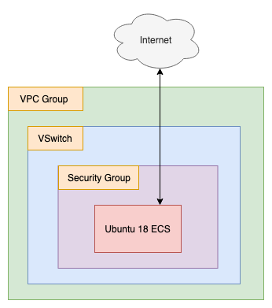

# Stress Test: Performance and Network Testing

WARNING: This code is still under development. It doesn't work yet so don't try to use the setup.sh or destroy.sh scripts!

The code should be done before the end of September 2019. Wish me luck!

## What

This terraform script sets up a single ECS instance and installs some stress testing and network performance testing tools (iperf, stress).

The script then set ups a Function Compute service called `ECSMonitoringService` with a single function called `ECSMonitoringFunction`, which runs the code in `index.py`. This code is a small Python 3 program that parses ECS events from Alibaba Cloud's [CloudMonitor](https://www.alibabacloud.com/product/cloud-monitor) service, then sends them to [Slack](https://www.slack.com) by using the Python `requests` library to call HTTP POST on a webhook generated by Slack (or more properly, generated by a Slack App). This causes a message to appear inside Slack each time an ECS event occurs. Events include things like creating or rebooting ECS instances, or taking disk snapshots.

## Why

CloudMonitor can generate its own email alerts and integrates well with [DingTalk](https://www.dingtalk.com), but doesn't have any official integration with 3rd party apps like Slack.

CloudMonitor can use "call back URLs" to call external services, but only supports HTTP now. For security reasons, Slack only supports HTTPS, so there's no way to directly integrate CloudMonitor with Slack. That's where Function Compute comes in. Function Compute allows us to make an HTTPS request against a webhook generated by Slack. 

This code exists to demonstrate this functionality and hopefully inspire others to take it further.

## How 

**Before you run any of the code here, make sure you have set up a Slack App with an external webhook, and you have put that webhook into your terraform.tfvars**.

To run terraform and automatically provision the resources defined in main.tf, open a terminal, navigate to the directory holding this README file, and then run:

```
./setup.sh
```

That should automatically execute `terraform apply`. If you are curious about what terraform will do, then before running setup.sh, you can run `terraform plan` like this:

```
terraform plan
```

When you are done playing with the test environment and are ready to delete all the resource created by terraform, run:

```
./destroy.sh
```

## Notes and Warnings

## Limitations

Only CloudMonitor **Event-based Alarm Rules** can make calls to Function Compute. Metric-based and Site monitoring Alarm Rules don't yet support triggering Function Compute code.

If you are feeling inspired, you could create a Function Compute call that is triggered by an HTTP request, then try setting the callback URLs in your CloudMonitor Alarm Rules to point at your Function Compute function!

## ECS Stuff

#### How To Log In

You can log into the ECS instance like so:

```
ssh -i name_of_key.pem root@instance_ip_address
```

You probably don't need to do this as you can trigger ECS operations from the console, but hey! I don't know what your plans are...do what you like! 

#### Dealing with SSH Key Permissions

You may need to restrict the permissions on the .pem file to avoid an angry warning from SSH. You can do that like so:

```
chmod go-rwx name_of_key.pem
```
#### Deleting SSH keys 

If you choose to execute `terraform destroy` by hand instead of using using `./destroy.sh`, be aware that the SSH key .pem file will **not** be deleted by terraform. This can cause problems if you try to execute `./setup.sh` or `terraform apply` again in the future, as this old .pem file will prevent a new .pem keyfile from being written, which will **cause your login attempts to fail**.

## Architecture

Once `./setup.sh` has run successfully, you end up with an architecture that looks like this:



The logical "flow" for the CloudMonitor + Function Compute + Slack integration looks something like this (coming soon!):

**Add diagram here**