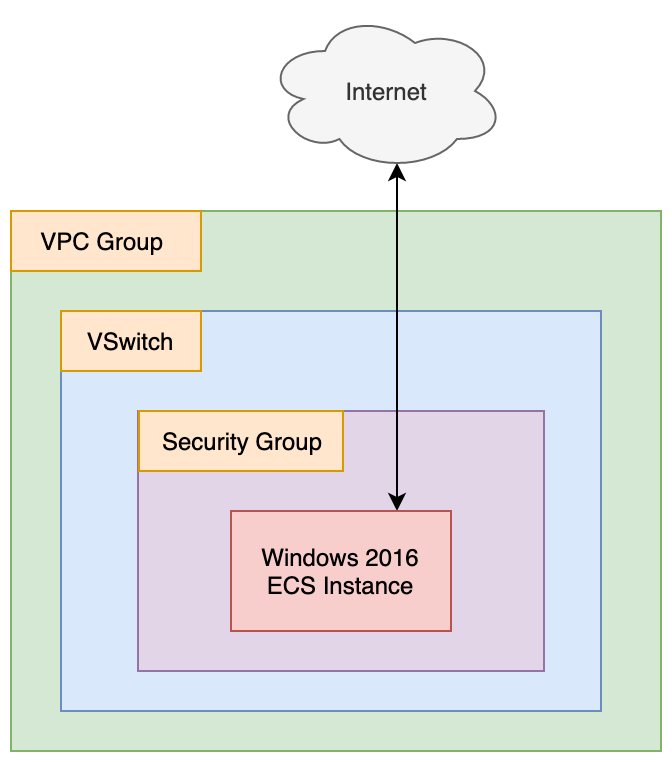

# Chrome On Windows

Terraform Version: 0.12
Alibaba Cloud Provider Version: 1.52
Status: Script working as of 2019-06-20 (YYYY-MM-DD)

## What

This terraform script sets up a Windows Server 2016 instance and automatically installs the Chrome browser using a PowerShell script borrowed from [here](https://medium.com/@uqualio/how-to-install-chrome-on-windows-with-powershell-290e7346271). 

Once the script has run, it outputs login information, so that you can log into the newly created ECS instance using an RDP client.

Directory contents:

```
.
├── README.md
├── diagrams
│   ├── chrome_on_windows.png
│   └── chrome_on_windows.xml
├── install_chrome.ps1
├── main.tf
├── outputs.tf
├── terraform.tfvars.example
└── variables.tf
```

The readme and diagrams (done using [draw.io](https://about.draw.io/)) are here for explanatory purposes. The files you probably care about are:

- main.tf (creates a VPC group, VSwitch, Security Group, and an ECS instance)
- variables.tf (variables used in main.tf)
- outputs.tf (outputs the public IP, username, and password of the ECS instance, for RDP access)
- install_chrome.ps1 (PowerShell script to fetch and install Chrome)
- terraform.tfvars.example (an example terraform.tfvars file)

## Why

Sometimes, you just need a remote desktop session somewhere else. Maybe for testing connectivity or load times for a website or application. Why install Chrome? Because Internet Explorer on Windows Server 2016 is a pain to use!

## How

First, copy `terraform.tfvars.example` to `terraform.tfvars`. Fill in your access key, access key secret, and a password for the Windows 2016 instance the terraform script will create for us. Then, open a terminal and "cd" into the chrome-on-windows directory, and run:

```
terraform init
```

Then:

```
terraform plan
```

Check the output. It should show that a Security Group, VPC group, VSwitch, and ECS instance will all be created. Finally, run:

```
terraform apply
```

Type "yes" at the prompt, and hit enter. That's it! In a few minutes you'll have a working Windows Server 2016 desktop, with Chrome preinstalled.

## Notes and Warnings

**Note: If Chrome fails to install, you may need to change the URL referenced in `install_chrome.ps1`.** You can find the Chrome installation bundles [here](https://cloud.google.com/chrome-enterprise/browser/download/#download) on Google's site.

## Architecture

The architecture for this system is as follows:



The architecture is very simple. Only a single ECS instance, VSwitch, Security Group, and VPC group are created. The idea is to keep things as simple as possible here!