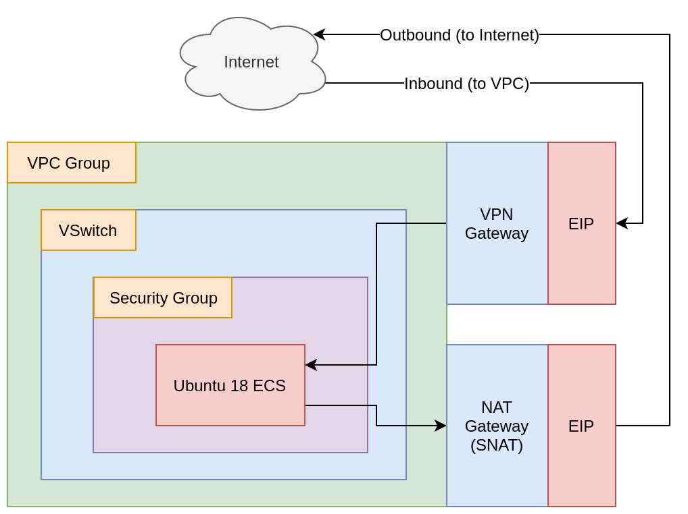

# VPN Gateway and NAT Gateway Setup: A Demo 

- Terraform Version: v0.12.6
- Alibaba Cloud Provider Version: v1.63
- Status: Script working as of 2019-12-17 (YYYY-MM-DD)

See this script in action [on YouTube](https://www.youtube.com/watch?v=9O9KPQ-O-IY&feature=youtu.be)!

## What

This script sets up a VPN Gateway and NAT Gateway attached to a VPC group, then creates a single ECS instances inside the VPC.

The ECS instance only has a private IP address, so it has no access to the internet on its own. The machine can make outbound connections via NAT Gateway (say, for software updates) and you can make inbound connections via SSL over the VPN Gateway (once you have configured an SSL VPN client on your local machine).

## Why

Network setup on the cloud is something new users struggle with. This script is a reference new users can consult to learn the relationship between VPC groups, VPN and NAT Gateways, and associated bindings and configurations (SNAT rules, Elastic IPs, and so on).

## How 

To run the terraform scripts located here, open a terminal and navigate to the directory holding this README, then type in:

```
./setup.sh
```

That should automatically execute `terraform apply`. If you are curious about what terraform will do, then before running setup.sh, you can run `terraform plan` like this:

```
terraform plan
```

When you are done playing and are ready to delete all the resource created by terraform, run:

```
./destroy.sh
```

## Notes and Warnings

If you choose to execute `terraform destroy` by hand instead of using using `./destroy.sh`, be aware that the SSH key .pem file will **not** be deleted by terraform. This can cause problems if you try to execute `./setup.sh` or `terraform apply` again in the future, as this old .pem file will prevent a new .pem keyfile from being written, which will **cause your login attempts to fail**.

## Architecture

Once `./setup.sh` has run successfully, you end up with an architecture that looks like this:


